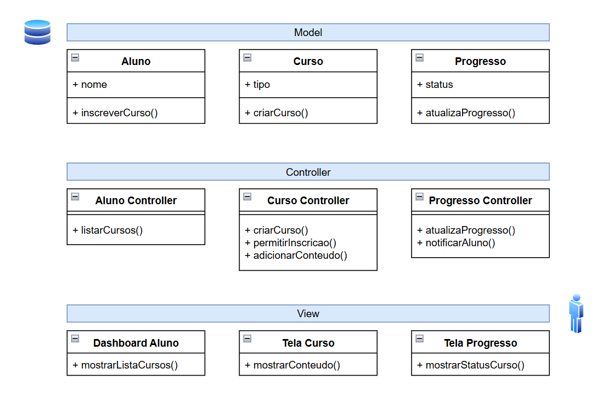
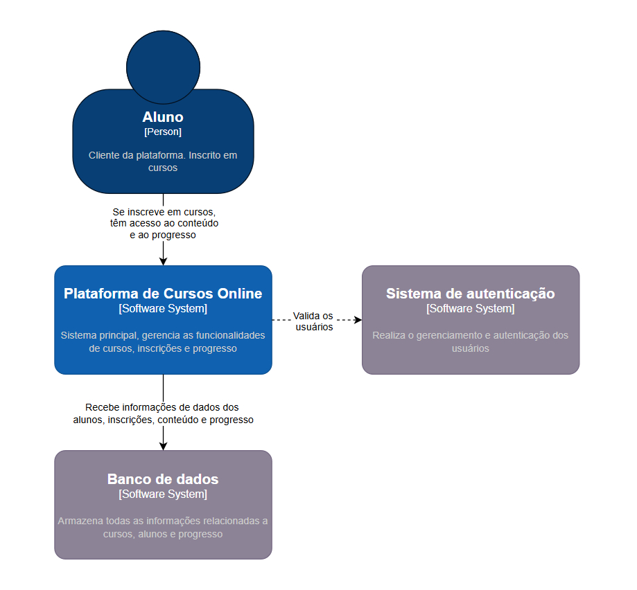
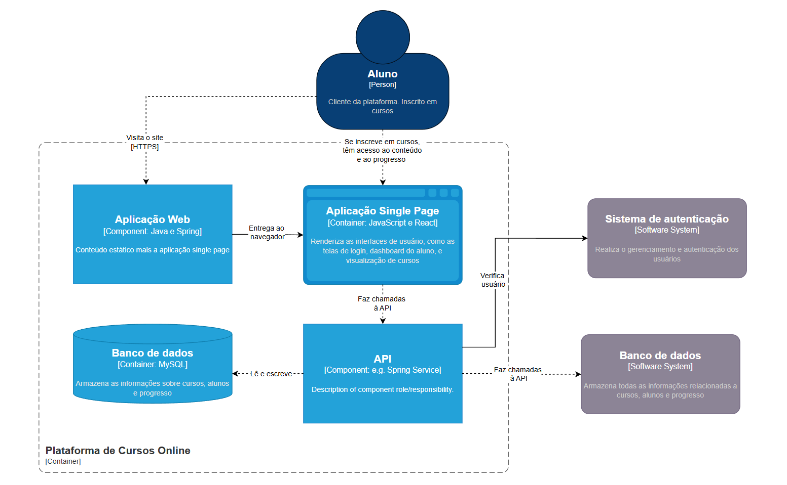
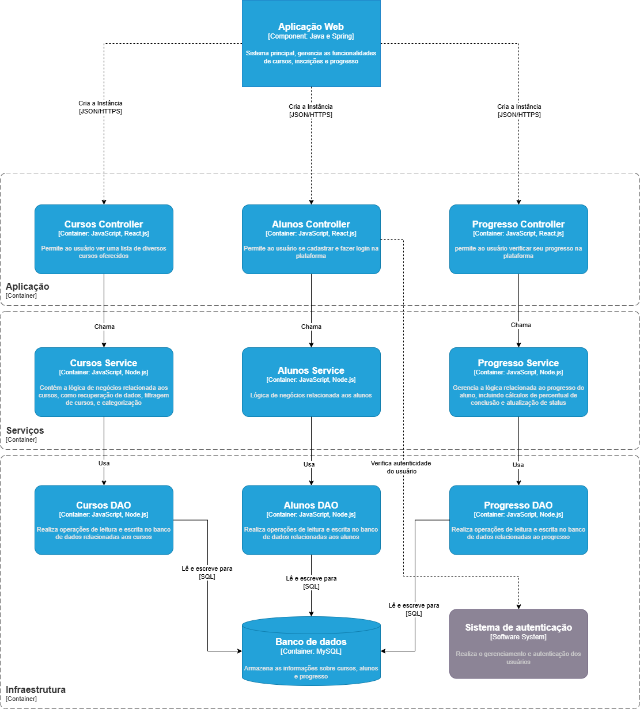
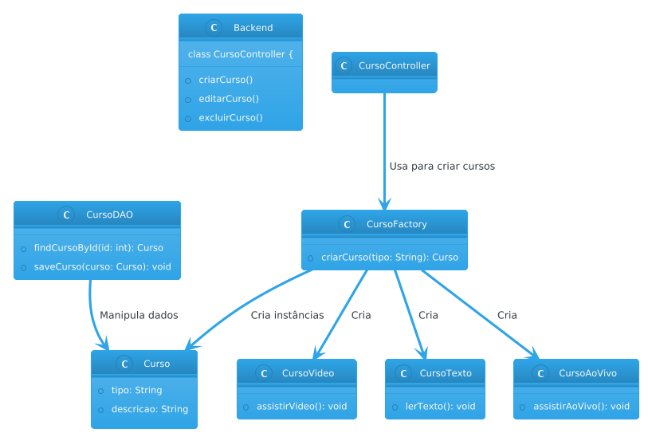
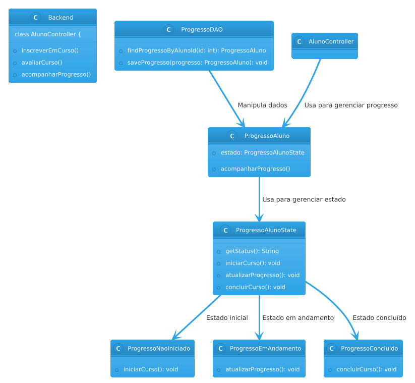

 <a href="#Descrição">Descrição</a> |
 <a href="#Diagramas">Diagramas</a> |
 <a href="#tecnologias">Tecnologias</a> |
 <a href="#autores">Autores</a>

# 
 Plataforma de Cursos Online
<section id="Descrição">

## 💻 Descrição:

A plataforma foca em criar um ambiente que proporcione a alunos a possibilidade de se inscrever em cursos de diferentes tipos através de uma aplicação single-page.  
Projeto focado no desenvolvimento web.
Os *Design Patterns* ***Factory*** e ***State***  serão utilizados para melhorar a qualidade do sistema.

</section>

<section id="Diagramas">
 
## 🔨Padrão arquitetural
* ### MVC
 

## 🗺️ Diagramas C4
* ### [Diagrama de contexto]
 

* ### [Diagrama de container]
  

* ### [Diagrama de componentes]
 

## 📐 Diagramas dos Padrões de projeto 

### Diagrama - Padrão Factory

O Padrão ***Factory*** será utilizado para a criação de diferentes tipos de cursos. Por exemplo, um método para criar instâncias de cursos em texto ou ao vivo.

### Diagrama - Padrão State

O Padrão ***State*** é utilizado para gerenciar o estado de progresso do aluno no curso. O progresso pode ter estados como "não iniciado", "em andamento" e "concluído", cada um com comportamentos específicos.

</section>

<section id="tecnologias">
</section>

## ⚙️ Tecnologias utilizadas

- JavaScript
- React
- Node.js
- MySQL
- SpringBoot

<section id="autores">
</section>  

## 🙏 Autores

- Lucas da Silva Carvalho 
- Leonardo Souza Faria de Moraes 